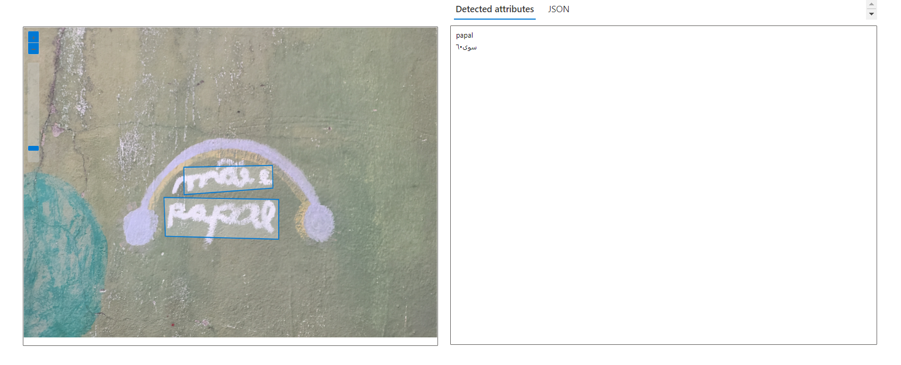

# Extraindo Texto de Imagens com Azure AI | Vision Studio

Neste exercício foi usado o serviço Azure AI para explorar os recursos de reconhecimento óptico de caracteres do Azure AI Vision. Eu usei o Vision Studio para experimentar a extração de texto de imagens, sem precisar escrever nenhum código.

## Extraindo Texto de Imagens

Escolhi cinco imagens da minha galeria que continham texto para testar o serviço de extração de texto de imagens do Vision Studio.

### Teste Imagem 1:

A primeira imagem que escolhi mostra uma blusa com um texto bordado.

A Inteligência Artificial conseguiu reconhecer o texto na imagem e retornou a palavra "STRENGTH", que é a mesma bordada na blusa.

### Teste Imagem 2:

A segunda imagem que escolhi mostra a capa de um livro com alguns textos espalhados por ela.

A Inteligência Artificial conseguiu reconhecer o texto na imagem e retornou "DISNEY", "GRAVITY FALLS", "BEST-SELLER do THE NEW YORK TIMES",  "3", "O diário perdido",
"UNIVERSO DOS LIVROS", textos que realmente estão na capa do livro.

### Teste Imagem 3:

A terceira imagem que escolhi mostra um texto escrito por uma criança em uma parede.

Dessa vez, a Inteligência Artificial não acertou o texto escrito na foto, retornando a palavra "papal" e outra palavra em árabe. O texto escrito na imagem era "mãe e papai".

### Teste Imagem 4:

A quarta imagem que escolhi mostra uma página de um caderno com um texto escrito à mão.

A inteligência Artificial conseguiu reconhecer o texto na imagem, dessa vez com poucos erros, e retornou "Funções", "Domínio, contradomínio e imagem:", "Domínio: Conjunto A;", "Contradomínio: Conjunto B;", "Imagem: A função - aplicada em x E A resulta em um elemento y E B.L
I V .".

### Teste Imagem 5:

Decidi deixar o melhor por último. A quinta imagem que escolhi foi tirada em um banheiro de uma sorveteria, ela mostra um aviso deixado por alguém que provavelmente já passou por uma situação bastante complicada antes e decidiu deixar avisado para evitar que ela se repita. 

A Inteligência Artificial conseguiu reconhecer o texto na imagem com quase nenhum erro e retornou as frases "Lembre-se >Depois de você Outras pessoas utilização o banheiro.", "Use este banheiro como se estivesse cometendo um crime. NÃO DEIXE VESTÍGIO.".

## Links

[Leia textos no Vision Studio](https://microsoftlearning.github.io/mslearn-ai-fundamentals/Instructions/Labs/05-ocr.html)

[Portal Vision Cognitive Azure](https://portal.vision.cognitive.azure.com)
